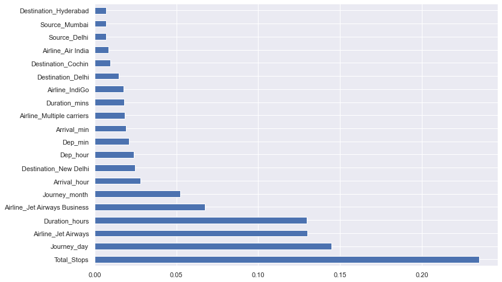
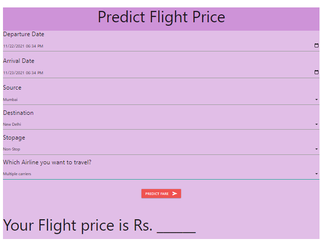

# About The Project 
This project aims to predict the price of flight on the basis of the historical data available.
The dataset used for this project is shared in the links section of readme 

# How to Run Project 
- virtualenv env 
- env/scripts/activate
- pip install -r requirements.txt
- Create a .env file with appropiate environment variables with help of .env_sample
- python manage.py runserver 

# Approach 
## Feature Engineering 
- Dropped feature "Duration" as it is already covered in arrival time and departure time
- Dropped Collumns with NA 
- Converted Date Of Journey into usable data format by creating separate collumns for day,month
- Departure time(Dep_Time) converted from string format (2h30m) to separate collumn for hours(Dep_hour) and minutes(Dep_min)
- Process used in Departure time is also repeated in arrival time 
- Route and Additional_Info do not provide any siginificant information to predict prices. Hence discarded 

## Data Preprocessing 
- Nominal Data(Data not in any order ) such as Airline,Source,Destination data is one hot encoded 
- Ordinal Data(Data which has order ) such as Total_Stops is LabelEncoded 

## Feature Selection 
- Heatmaps were used to understand the correlation between features available

- ExtraTreesRegressor was also used to identify important features 

## Performed Regression using Random Forests 
- Monitored RSME score while performing regression with random forests 
- 80% of data was kept for training and 20% for testing
- Training Results were 95% on train data and 79% on test data.

- R2 Score On Results obtained was 0.7964

## Hyperparameter Tuning 
- Used RandomizedSearchCV to perform hyperparameter tuning. The parameters we tried to find best value were 
    1. Number of trees in random forest (n_estimators)
    2. Number of features to consider at every split(max_features)
    3. Maximum number of levels in tree(max_depth)
    4. Minimum number of samples required to split a node(min_samples_split)
    5. Minimum number of samples required at each leaf node(min_samples_leaf)

# Flowchart Of Methodology 

# Links 
- Dataset Link : https://www.kaggle.com/nikhilmittal/flight-fare-prediction-mh/
- Live Link : https://fierce-plateau-27365.herokuapp.com/

# Screenshots 
## Frontend 

## Sample Input 

## Sample Output 

Note:- Once the ML MODEL predicts the price the data filled in the form is reset to default values 